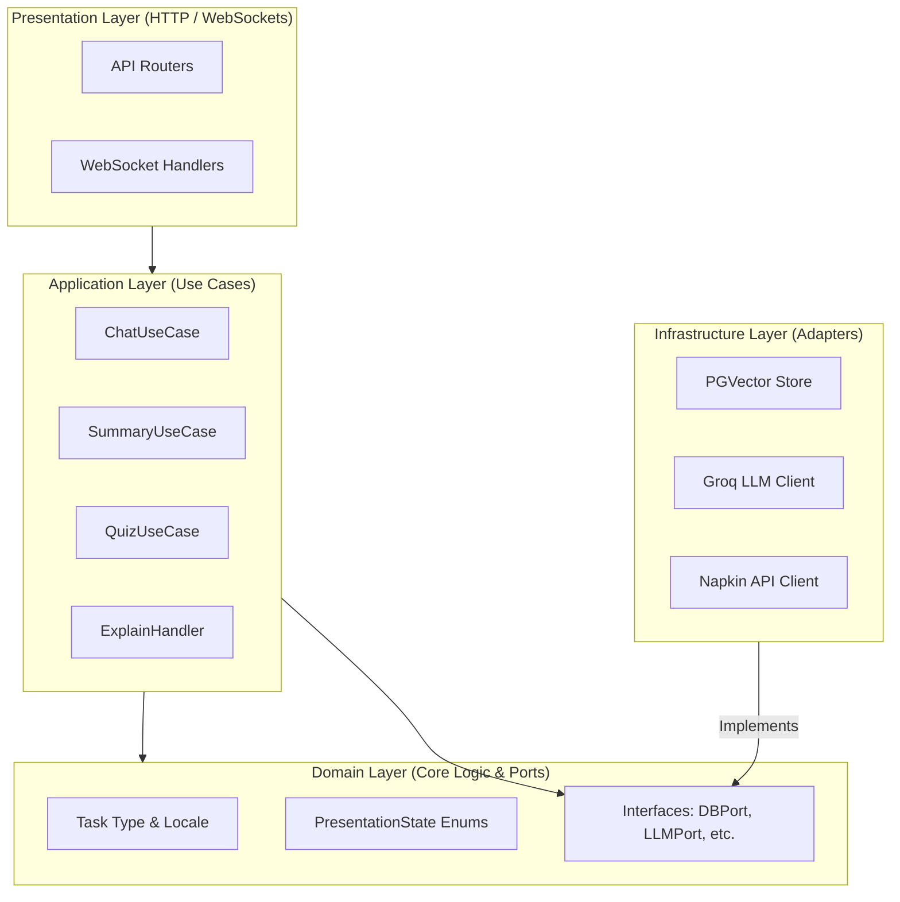
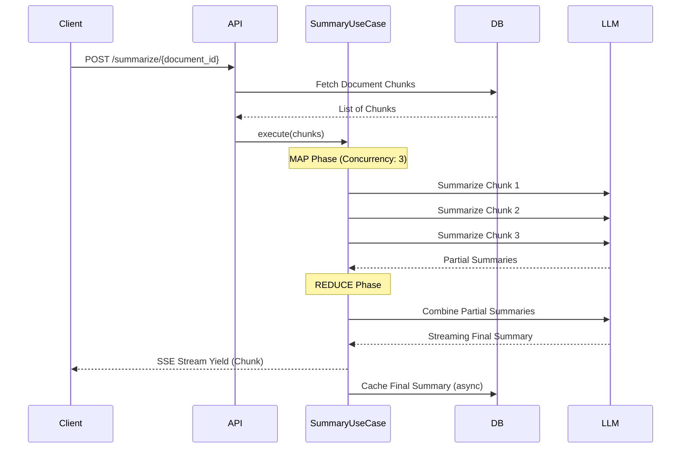
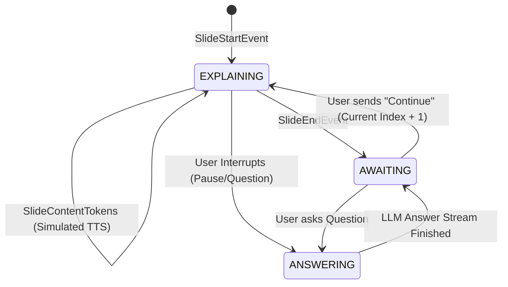

# VirtAI Architecture Documentation

## Overview
VirtAI follows a clean **Ports and Adapters** (Hexagonal) Architecture to isolate core domain logic from external dependencies (frameworks, LLMs, external APIs, and DBs).

## Ports and Adapters
The architecture guarantees that business rules (`app/domain`) and Use Cases (`app/application`) do not depend on external systems (`app/infrastructure` or `app/presentation`).



## Map-Reduce Summary Flow
The `SummaryUseCase` is responsible for parsing large documents without exhausting LLM rate limits or context windows, achieving this via an Async Map-Reduce architecture governed by `asyncio.Semaphore(3)`.



## WebSocket State Machine (Explain Mode)
The "Slide-by-Slide Explain Mode" utilizes a persistent server-side State Machine to stream documents, intercept questions mid-presentation, and resume flawlessly.



## The Sentinel Pattern (Graceful Degradation)
To protect the frontend User Experience from unhandled 500 crashes due to external API failures (e.g., Napkin API quotas), we employ the **Sentinel Pattern**. 

Instead of raising exceptions when an external service fails, the Adapter returns a safe, controlled JSON envelope:
```json
{
  "unavailable": true,
  "reason": "quota_exceeded"
}
```
The Frontend UI consumes this payload and gracefully renders a localized `toast.error`, or hides the UI trigger entirely if `reason === "not_configured"`.
