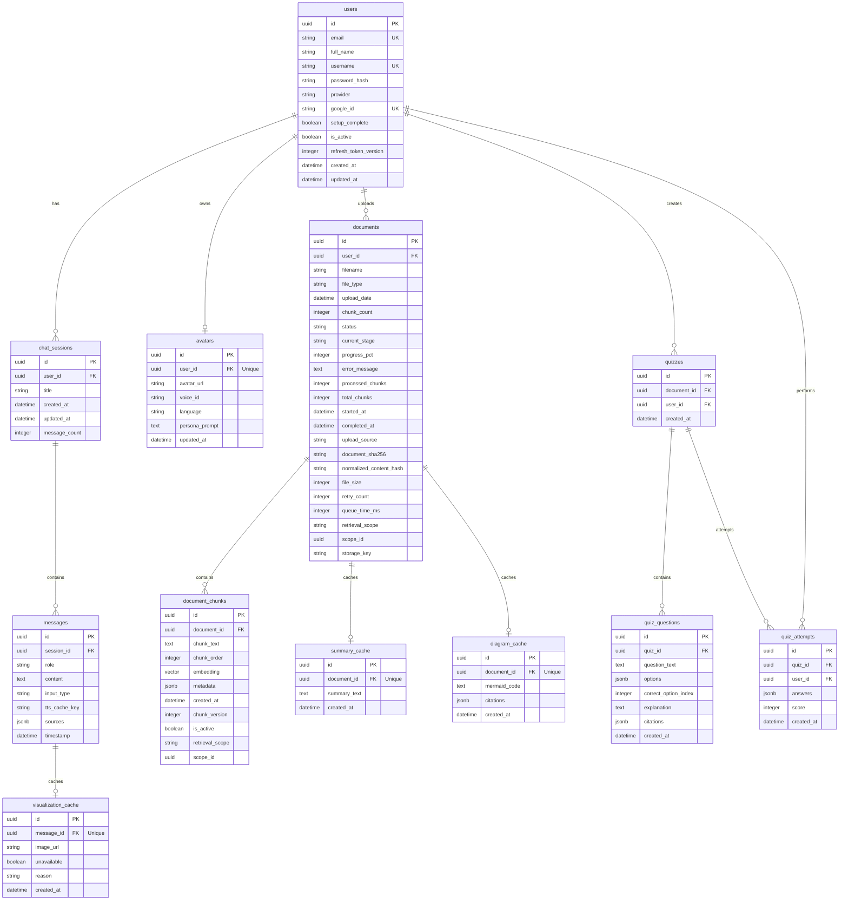
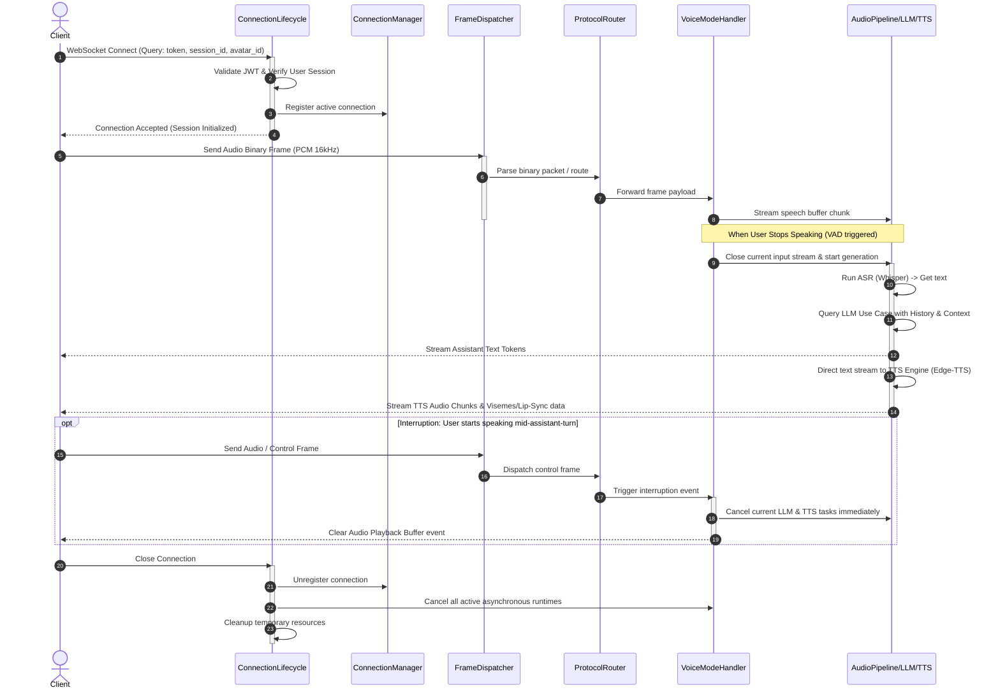

# VirtAI Visual Architecture Map

This document provides a visual map of the VirtAI backend architecture, mapping the database entity relationships, real-time WebSocket connection lifecycles, and the Retrieval-Augmented Generation (RAG) task pipelines.

---

## 1. Database Entity-Relationship Diagram (ERD)

The following diagram maps the exact database tables, columns, and foreign key relationships defined in [models.py](file:///D:/A/Projects/VirtAI-Project/backend/app/infrastructure/db/models.py). It includes users, chat sessions, documents, document chunks, quizzes, attempts, and caches.



---

## 2. WebSocket Real-Time Flow

This diagram illustrates the message routing, session initialization, pipeline processing, and interruption sequence for real-time educational avatar sessions. The flow spans presentation routers, handlers, and application use cases.



---

## 3. RAG & Document Processing Pipeline

The ingestion and retrieval process transforms unstructured documents into structured, vector-indexed chunks and retrieves them using task-aware constraints.

```mermaid
flowchart TD
    subgraph Ingestion ["Ingestion Pipeline (Background Worker)"]
        A[Document Upload] --> B[PDF/Markdown Extractor]
        B --> C[Smart Chunker]
        C --> D[Embedding Provider - FastEmbed]
        D --> E[(PGVector Store)]
    end

    subgraph Retrieval ["Retrieval & Task Context Assembly"]
        F[User Query] --> G{Task Classifier}
        
        G -->|Explain| H[Explain Use Case]
        G -->|Quiz| I[Quiz Use Case]
        G -->|Diagram| J[Diagram Use Case]
        G -->|Summary| K[Summary Use Case]

        H & I & J & K --> L[Query Vectorization]
        L --> M[PGVector Search - Cosine Similarity]
        E --> M
        M --> N[Retrieval Context Budgeting]
        N --> O[LLM Prompt Synthesis]
        O --> P[Assistant Output Response]
    end

    classDef database fill:#282a36,stroke:#bd93f9,stroke-width:2px,color:#fff;
    class E database;
