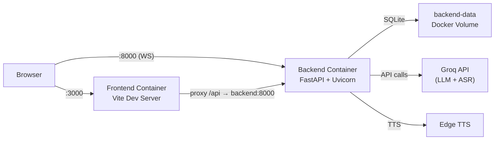

# **Docker Environment Setup**

## **Overview**

This document describes how the **Docker environment** for the VirtAI project was configured so the **entire stack (frontend + backend)** can be started or stopped with a single command.

<body>
    <div style = "
        width: 100%;
        height: 30px;
        background: linear-gradient(to right,rgb(235, 238, 212),rgb(235, 238, 212));">
    </div>
</body>

> ## ⚠️ Important — Docker Required
>
> You **must** have **Docker Desktop** installed and **running** before using any of the commands below.
>
> **Not installed?** Download it from the official website:
>
> 🔗 [https://www.docker.com/products/docker-desktop](https://www.docker.com/products/docker-desktop)
>
> After installation, **open Docker Desktop** and wait until it shows **"Engine Running"** before proceeding.

<body>
    <div style = "
        width: 100%;
        height: 30px;
        background: linear-gradient(to right,rgb(235, 238, 212),rgb(235, 238, 212));">
    </div>
</body>

# **Files**

| **File** | **Purpose** |
|---|---|
| **docker-compose.yml** | Orchestrates backend and frontend services |
| **backend/Dockerfile** | Python 3.10 slim container running FastAPI + Uvicorn |
| **backend/.dockerignore** | Excludes cache, env files, and local data from Docker build |
| **frontend/Dockerfile** | Node 20 Alpine container running the Vite dev server |
| **frontend/.dockerignore** | Excludes node_modules and dist from Docker build |
| **scripts/start_docker.sh** | Start script for Linux/macOS |
| **scripts/start_docker.bat** | Start script for Windows (double-click supported) |
| **scripts/stop_docker.sh** | Stop script for Linux/macOS |
| **scripts/stop_docker.bat** | Stop script for Windows |
| **scripts/rebuild_docker.sh** | Rebuild containers for Linux/macOS |
| **scripts/rebuild_docker.bat** | Rebuild containers for Windows |

<body>
    <div style = "
        width: 100%;
        height: 30px;
        background: linear-gradient(to right,rgb(235, 238, 212),rgb(235, 238, 212));">
    </div>
</body>


# **Architecture**



<body>
    <div style = "
        width: 100%;
        height: 30px;
        background: linear-gradient(to right,rgb(235, 238, 212),rgb(235, 238, 212));">
    </div>
</body>

# **Quick Start**

| Action | Windows | Linux / Mac |
|---|---|---|
| **Start** | `scripts\start_docker.bat` | `bash scripts/start_docker.sh` |
| **Stop** | `scripts\stop_docker.bat` | `bash scripts/stop_docker.sh` |
| **Rebuild** | `scripts\rebuild_docker.bat` | `bash scripts/rebuild_docker.sh` |

> Or use Docker directly on any OS:
> ```bash
> docker compose up --build                             # Start
> docker compose down                                   # Stop
> docker compose build --no-cache && docker compose up  # Rebuild
> ```

<body>
    <div style = "
        width: 100%;
        height: 30px;
        background: linear-gradient(to right,rgb(235, 238, 212),rgb(235, 238, 212));">
    </div>
</body>

# **Inter-Service Communication**

### **HTTP API**

The frontend Vite proxy forwards all requests:

```
/api/*  →  backend:8000
```

inside the Docker network.

---

### **WebSocket**

The browser connects directly to:

```
ws://localhost:8000
```

which Docker maps to the backend container.

---

### **Database**

SQLite data is persisted inside a Docker volume:

```
/app/.data/  →  named volume: backend-data
```

---

### **Health Check**

The backend exposes a health endpoint:

```
/api/v1/health
```

The frontend container waits for this endpoint before starting.

<body>
    <div style = "
        width: 100%;
        height: 30px;
        background: linear-gradient(to right,rgb(235, 238, 212),rgb(235, 238, 212));">
    </div>
</body>

# **Validation Checklist**

* ✅ Health endpoint confirmed at `/api/v1/health`
* ✅ Docker Compose healthcheck configured correctly
* ✅ Frontend waits for backend using `depends_on` + `service_healthy`
* ✅ Ports mapped:
  * `3000:3000` → frontend
  * `8000:8000` → backend
* ✅ Shared Docker bridge network `virtai-network`
* ✅ SQLite persisted using named volume `backend-data`
* ✅ No hardcoded `localhost` for container-to-container communication
* ✅ Scripts handle:
  * Docker not installed
  * Docker not running (auto start)
  * Containers already stopped
